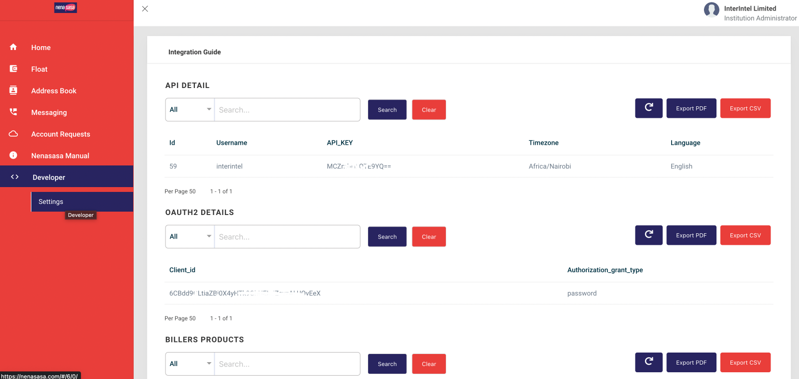
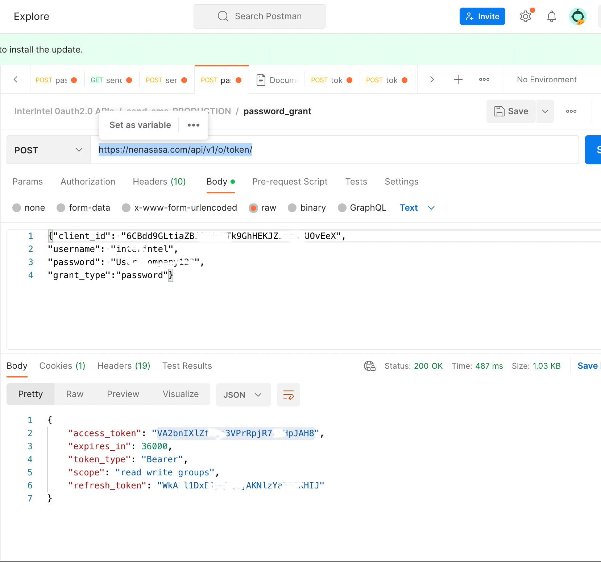
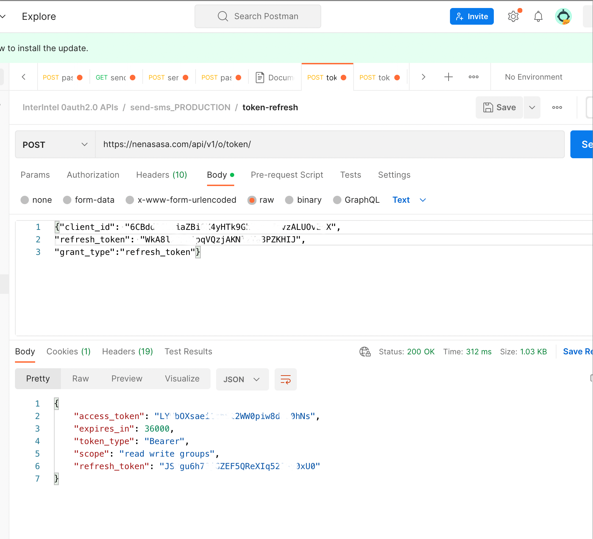
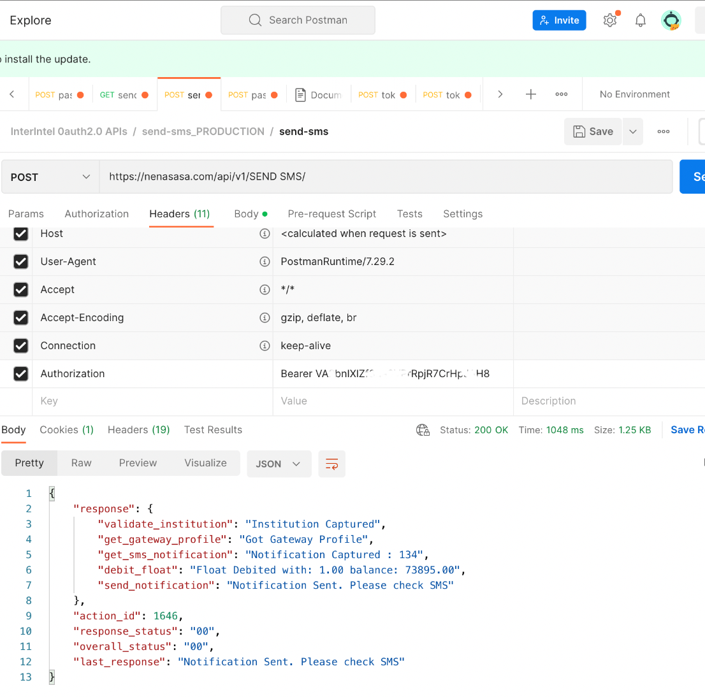
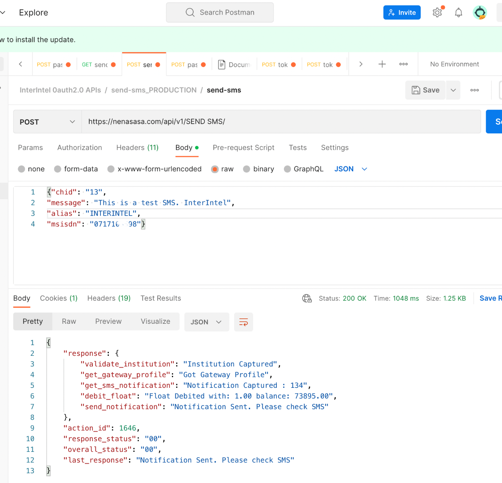

## A Guide on how to Consume the BULK SMS API using Oauth2.0 ##

### Table of Contents
[1.0 Get the Login Details.](#10-get-the-login-details)  
[2.0 Get an Access Token and a Refresh Token.](#20-get-an-access-token-and-a-refresh-token)  
[3.0 Formulate the Request.](#3.0-formulate-the-request)

You can click on the images to get full page view if some details are not clear.

#### 1.0 Get the Login Details #####

Get the Oauth2 login details from the Nenasasa portal under Developer->Settings section. 

<i>The details are: client_id, username and Authorization_grant_type. You'll also need to use your existing password.</i>

#### 2.0 Get an Access Token and a Refresh Token ####
To get an access_token and a refresh_token, make a request to the Nenasasa endpoint (https://nenasasa.com/api/v1/o/token/) as illustrated below. They last for 3600 seconds (10 hours). 

You can use the same endpoint to refresh the token and receive a new token whenever the access token expires.

#### 3.0 Formulate the Request ####
You'll then need to add the access token to the Authorization header (Authorization: Bearer {access_token}) when making the SMS request.

 

 
 <i>Add the access token to Authorization Header </i>

     
 
 And then formulate the request body as below. The endpoint changes to (https://nenasasa.com/api/v1/SEND%20SMS).
 

 
 

